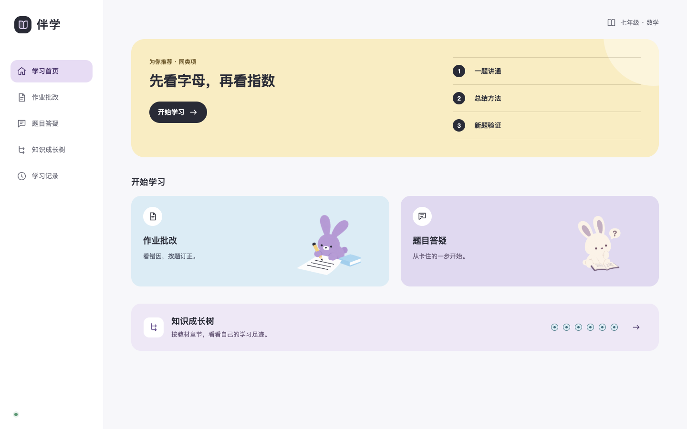
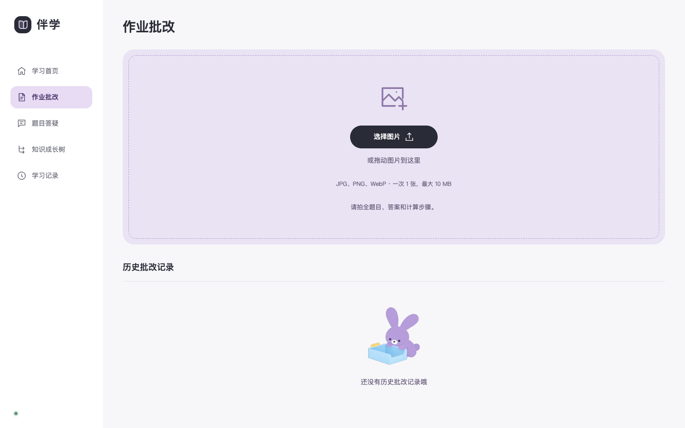
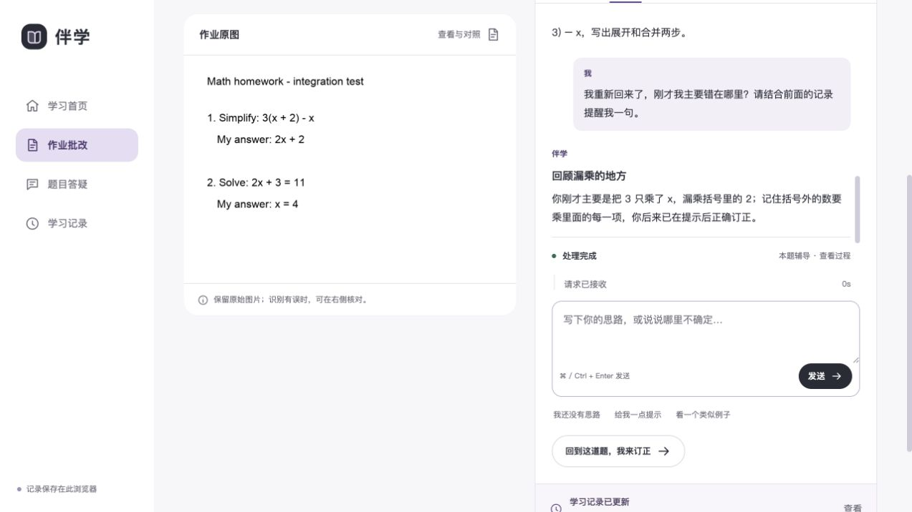
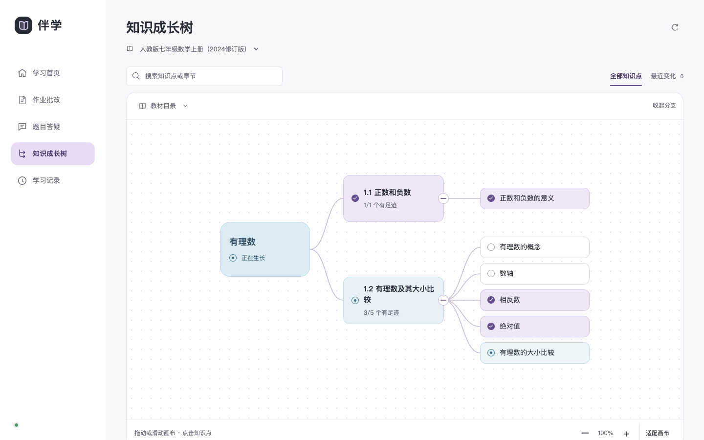

<div align="center">
  <h1>伴学</h1>

</div>

<p align="center">从真实作业出发，连接批改、辅导、学习记录与下一次学习。</p>


## 伴学想解决什么

学生做错一道题后，真正重要的往往不是立刻看到答案，而是：

- 他原来是怎么做的？
- 他卡在知识、方法、运算，还是抄写？
- 这次获得了多少提示？
- 换一道题后，还能不能自己完成？

伴学保留原始作答和每次帮助，把一次学习组织成可追溯的闭环：

```text
上传作业 → 按题批改 → 主动求助 → 完成订正 → 新题验证 → 更新学习记录 → 接着上次学
```




## 一次完整体验

### 1. 上传自己的作业或题目

选择一张包含题目、答案和计算过程的图片。作业批改适合整页作业，题目答疑适合一道具体问题。



### 2. 保留原答，按题订正

伴学识别题目与学生原答，按题展示批改结果。学生可以先核对识别内容，再选择自己订正、请求提示，或让 AI 帮助分析。



选中一道题不等于向 AI 求助。只有学生主动点击并提交问题后，系统才会开始辅导；推荐问题也只会填入输入框，不会自动发送。

### 3. 形成可核查的学习记录

系统分别保存原答、订正、对话、获得的帮助和后续验证结果。事实与 AI 的暂定判断分开记录，学生可以回到原题查看依据。

当不同作业中出现重复困难时，首页才会生成“一题讲通—总结方法—新题验证”的学习推荐；证据不足时不会用虚构内容填充。

### 4. 在知识成长树中继续学习

知识成长树按教材章节组织学习足迹。点亮表示这里已经出现过可追溯证据，不代表学生已经永久掌握；仍需补强的知识点可以直接发起一道新题验证。



## 主要功能

| 使用场景 | 伴学提供的体验 |
| --- | --- |
| 作业批改 | 上传整页作业，查看题目、原答、批改结果和原图定位 |
| 题目答疑 | 从一道卡住的题开始，先表达思路，再按需获得提示或分析 |
| 多轮辅导 | 结合当前题、已有讨论和有效学习记录继续追问 |
| 学习记录 | 跨作业整理错题、订正、帮助事实和下一步任务 |
| 学习推荐 | 达到真实证据门槛后，生成讲方法并安排迁移验证的短学习单元 |
| 知识成长树 | 按教材查看知识点学习足迹、近期变化和待补强位置 |
| 画板模式 | 保留学生笔迹，学生主动请求后才让 AI 查看并生成待确认草稿 |

## 它与普通答题助手有什么不同

- **先保留学生的思路**：原始作答不会被订正结果覆盖。
- **帮助由学生触发**：浏览题目、切换题号不会自动请求 AI。
- **区分会做与被帮助后做对**：提示、答案或他人帮助都会单独记录。
- **判断必须能回到证据**：学习记忆需要引用真实题目和学习事件。
- **用新题验证迁移**：不是把原题再做一遍，也不是“看懂了”就算学会。
- **让记忆影响下一次教学**：学习记录不是独立报表，而是后续辅导的上下文。

## 本地体验

### 需要准备

- Python 3.11 或更高版本
- 已安装并登录的 [Codex CLI](https://developers.openai.com/codex/cli)
- 现代桌面浏览器

### 启动

克隆仓库并进入项目根目录后运行：

```bash
codex login
python3 backend/server.py --port 4178
```

打开 <http://127.0.0.1:4178> 即可开始体验。

第一次体验可以上传项目自带的人工测试图片：

```text
backend/fixtures/homework-test.png
```

这张图片不包含真实学生信息，只用于检查图片识别、批改与辅导链路是否能够运行。

<details>
<summary><strong>macOS：让服务登录后自动运行</strong></summary>

```bash
python3 scripts/banxue_service.py install
python3 scripts/banxue_service.py status
```

源码更新后再次执行 `install` 即可同步运行版本。移除自动运行服务：

```bash
python3 scripts/banxue_service.py uninstall
```

卸载服务不会删除已有学习记录。

</details>

## 数据与隐私

- 页面、作业状态与画板内容保存在当前浏览器；学习证据和请求结果保存在本机 SQLite。
- 本机服务只监听 `127.0.0.1`，不会作为公网服务开放。
- **本地优先不等于完全离线**：上传图片、学生输入与必要学习上下文会经已登录的 Codex CLI 发往对应模型服务。
- 当前没有账号、多用户隔离、跨设备同步、数据保留策略或完整隐私管理界面。
- 请勿使用带有真实姓名、学号、学校等敏感信息的学生材料进行演示。

## 当前适用范围

目前最适合用于：

- 在电脑浏览器中体验初中数学作业批改与订正闭环；
- 演示“学习记忆如何改变下一次辅导”；
- 研究提示后完成与独立完成的证据差异；
- 探索知识成长树、迁移验证和主动式 AI 辅导交互。

当前默认课程结构为人教版七年级数学上册（2024 修订）。其他教材、年级和学科尚未建立经过核验的课程映射。

## 已知限制

- 图片识别、批改和教学建议尚未建立系统质量基准；重要结果需要人工复核。
- 真实学生研究、长期保持和学习效果评估尚未开展。
- 推荐学习单元中的迁移题仍在完善完整的提交与长期复测闭环。
- 画板是 P0 实验能力，不是完整白板产品。
- 当前只适合本机单用户体验，不适合直接部署为学校或机构服务。

## 常见问题

<details>
<summary><strong>为什么首页没有学习推荐？</strong></summary>

推荐只基于真实学习记录生成。通常需要至少 2 份作业、3 条题目记录，并且同一知识点在不同作业中出现重复的待补强信号。证据不足时，伴学会先引导继续完成真实学习任务。

</details>

<details>
<summary><strong>“知识点已点亮”是不是代表完全掌握？</strong></summary>

不是。点亮只表示这里已有可追溯的学习证据。帮助后完成、首次独立完成和后续复测会被区别记录，不能据一次结果推断长期掌握。

</details>

<details>
<summary><strong>可以把它部署到公网给多人使用吗？</strong></summary>

当前不建议。项目尚未实现账户、多用户数据隔离、生产级隐私治理和公网部署安全措施，模型与教学质量也未达到生产验收标准。

</details>

## 了解更多

- [原型使用说明](prototype/README.md)

<details>
<summary><strong>开发、测试与贡献信息</strong></summary>

后端使用 Python 标准库与 SQLite，前端使用原生 HTML、CSS 和 JavaScript，无构建步骤。运行测试：

```bash
PYTHONPATH=backend python3 -m unittest discover -s backend -p 'test_*.py' -v
node --test prototype/*.test.cjs
```

贡献时请保持以下边界：

1. 不把“获得帮助后完成”写成“首次独立完成”；
2. 不在正常产品路径加入 mock 数据或静默降级；
3. 新增协议、状态或证据规则时同步补充测试；
4. 在 Pull Request 中明确哪些部分已经验证，哪些仍是待验证假设。

后端实现见 `backend/`，当前前端实现见 `prototype/`。

</details>

## 许可证

本项目原创代码采用 **GNU Affero General Public License v3.0 only（AGPL-3.0-only）**，完整条款见 [LICENSE](LICENSE)。允许使用、修改和分发；分发修改版本或向用户提供修改版本的网络服务时，应按许可证要求提供对应源码并保留声明。

`prototype/vendor/penecho/draw.js` 来自 PenEcho `v1.3.1`，同样按 **AGPL-3.0-only** 分发；原始许可证、声明与上游来源保留在 [`prototype/vendor/penecho/`](prototype/vendor/penecho/)。

许可证不授予第三方商标、教材、引用资料或其他第三方素材的权利；这些内容仍受各自权利和许可约束。
